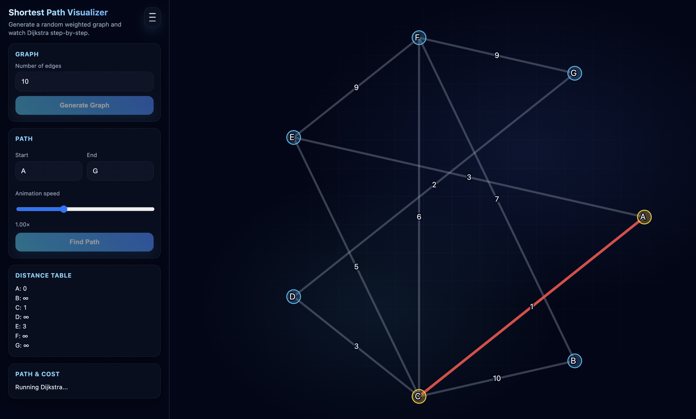
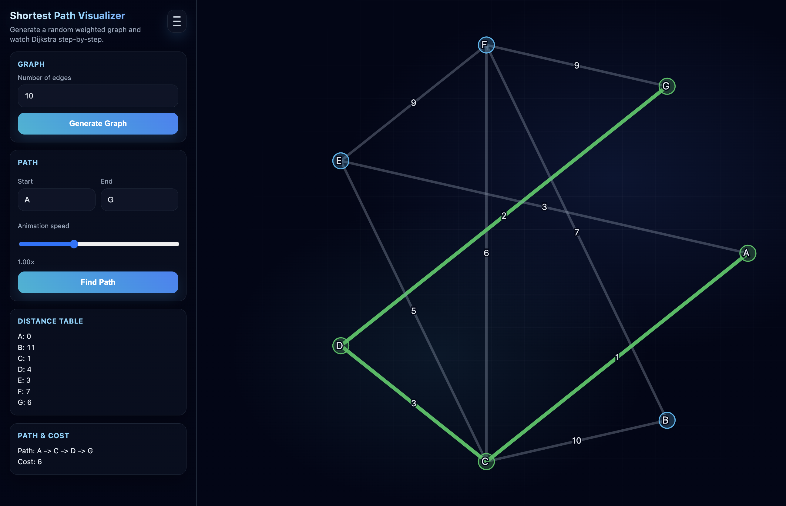

# Shortest Path Visualizer (Dijkstra)

**DSA project:** a static web page that builds a small random weighted graph and **animates Dijkstra’s algorithm** so anyone can see how shortest-path search unfolds, then see the **final path and total cost**.

---

## Use it (no install)

- **Live site:** [https://djikstra-web-visualizer.vercel.app/](https://djikstra-web-visualizer.vercel.app/)
- Open the link → **Generate Graph** (optional) → set **Start** / **End** → **Find Path** → watch the graph and **Distance Table** update → read **Path & Cost** when it finishes.
- Use the **menu** (top-right) for a short **About** blurb on what the demo is doing.
- Adjust **Animation speed** if steps feel too fast or slow.

---

## Screenshots

<p align="center">
  <br />
  <em>Overview — controls + graph</em>
</p>

<p align="center">
  <br />
  <em>During the run — distances and highlights</em>
</p>

<p align="center">
  <br />
  <em>Final result — shortest path in green + cost</em>
</p>

---

## What this project demonstrates

- **Single-source shortest paths** on a **weighted, undirected** graph with nodes **A–G**.
- **Priority-driven** expansion: the implementation always processes the current best-known minimum-distance node (array used as a priority queue; conceptually the same idea as Dijkstra).
- **Edge relaxation:** trying an edge updates distances when a shorter route is found.
- **Early stop:** once the **destination** is finalized (popped with its shortest distance), the animation stops expanding the rest of the graph for clearer viewing.
- **Visual feedback:** current node highlight, “bad” edge try, then reset; final path edges/nodes emphasized in **green**.

---

## Algorithm (short)

- Initialize distances: start `0`, all others `∞`; previous pointers unset.
- Repeat: take the node `u` with **smallest** tentative distance from the frontier.
- Skip stale entries if `u`’s distance no longer matches the queue key.
- If `u` is the **end** node, **stop** (shortest distance to end is known).
- Otherwise relax every edge `(u, v)` with weight `w`: if `dist[u] + w < dist[v]`, update `dist[v]` and `prev[v]`, push the new pair onto the frontier.
- After the run, **reconstruct** the path from `prev` from end back to start.

---

## Complexity (typical Dijkstra)

- **Time:** `O((V + E) log V)` with a binary heap; this demo uses a sorted array for the frontier, which is simpler but not optimal for huge graphs.
- **Space:** `O(V + E)` for the graph and distance arrays (here `V = 7`).

---

## Features (UI / behavior)

- Random graph with a **configurable edge count** (capped so the layout stays readable).
- **vis-network** graph: straight edges, weights on edges, fixed circular node positions.
- **Distance table** updates during the run; **Path & Cost** shows the final route and sum of weights.
- **Toast** messages for generate / errors / completion.
- **No build step:** open locally or deploy as a static site.

---

## Tech stack

- **HTML / CSS / JavaScript**
- **[vis-network](https://visjs.org/)** (CDN in `index.html`)

---

## Project structure

| Path | Role |
| ---- | ---- |
| `index.html` | Layout, vis-network script, UI shell |
| `style.css` | Styling, sidebar, menu, graph stage |
| `script.js` | Graph generation, Dijkstra + animation, UI wiring |
| `screenshots/` | Optional PNGs for this README |

---

## Run locally

- Clone the repo and open `index.html` in a browser, **or** from this folder run:

```bash
npx --yes serve .
```

- Then open the URL printed in the terminal (often `http://localhost:3000`).

---

## Deploy

- The public demo is on **Vercel**. To deploy your fork: connect the repo (or this directory), use a **static** preset, root = this project folder, entry `index.html`.

---

## Possible extensions

- Larger / directed graphs, step **back** / **pause**, or a true binary heap for the queue.
- Toggle **show visited order** or **edge relaxations** count.
- Export graph as JSON; import custom graphs for assignments.

---

*Made with heart by Maulik Sonigra*
